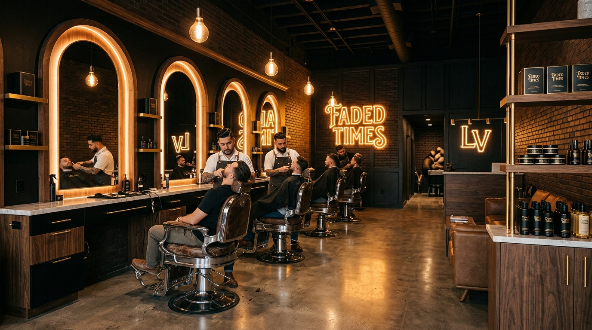

# Faded Times Barbershop (@fadedtimeslv) - Website & Booking Template

A modern, mobile-first, high-converting website and interactive booking template built for **Faded Times Barbershop** (@fadedtimeslv), located in Las Vegas, NV at **3868 W Sahara Ave** (Valley Oaks Plaza).



## 💈 About The Business

- **Shop Name**: Faded Times Barbershop (Faded Times Vegas)
- **Instagram**: [@fadedtimeslv](https://www.instagram.com/fadedtimeslv/)
- **Location**: 3868 West Sahara Avenue, Las Vegas, NV 89102 (Valley Oaks Plaza, Sahara Ave & Valley View Blvd)
- **Phone**: (702) 272-2457
- **Hours**:
  - Tuesday – Friday: 9:00 AM – 6:00 PM
  - Saturday: 9:00 AM – 4:00 PM
  - Sunday & Monday: Closed

---

## 🌟 Key Features

- **Real-Time Shop Status Indicator**: Dynamically calculates whether the shop is open or closed based on actual Las Vegas (PST/PDT) time and displays walk-in wait estimates.
- **Interactive Multi-Step Booking Modal**:
  - Step 1: Service selection (Signature Haircut $40, Haircut & Beard $50, Beard Trim $20, Kid's Cut $40, Royal VIP $65, etc.)
  - Step 2: Master Barber selection (Any Available, Sam, Chris, Leo)
  - Step 3: Date & time slot picker
  - Step 4: Instant booking confirmation with **Add to Google Calendar** and **.ICS download**
- **Instagram Lookbook Feed (`@fadedtimeslv`)**: Filterable gallery of skin fades, tapers, beard sculpts, and custom hair art designs with high-res Lightbox viewer.
- **Meet The Master Barbers**: Individual craftsman spotlights, experience levels, and direct booking links.
- **Client Testimonials & Reviews**: Verified 5-star reviews filterable by Locals, Strip Tourists, and Beard Care.
- **Location & Directions**: Embedded map with 1-click Google Maps / Apple Maps directions.
- **VIP Club**: Promo code generator unlocking 10% discount on first visit (`FADED10`).
- **Mobile Persistent Action Bar**: Sticky quick-dial, appointment booking, directions, and Instagram link.

---

## 🚀 Getting Started

### Local Development
Clone the repository and open `index.html` in your browser, or run a local web server:

```bash
# Clone repository
git clone https://github.com/mandraxor/barbershop-template-fadedtimeslv.git

# Navigate to directory
cd barbershop-template-fadedtimeslv

# Serve locally
npx serve .
```

Visit `http://localhost:3000` to view the website.

---

## 📁 Project Structure

```
barbershop-template-fadedtimeslv/
├── index.html          # Main single-page application
├── css/
│   └── styles.css      # Dark luxury barbershop styling & animations
├── js/
│   └── app.js          # Booking engine, live clock, gallery & lightbox
├── assets/
│   └── images/         # High-resolution photography & haircut assets
└── README.md           # Documentation
```

---

## 📄 License

MIT License © 2026 Faded Times Barbershop Template
